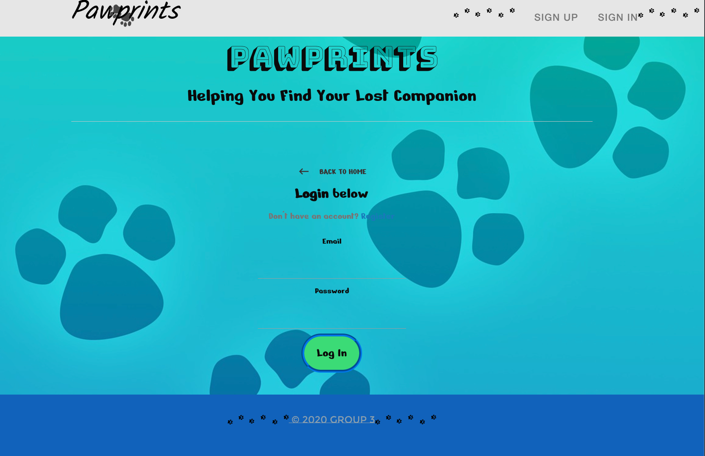

# Paw Prints
## Description
This app is a platform where users can create posts about their lost pets, and others can see the post and reach out to the pet owner to give them information and help out. 

## Table of Contents
- [Paw Prints](#paw-prints)
  - [Description](#description)
  - [Table of Contents](#table-of-contents)
    - [Installation](#installation)
    - [Usage](#usage)
    - [Collaborators](#collaborators)
      - [License](#license)
      - [Questions?](#questions)
      - [Additional Information](#additional-information)
  - [Screenshot](#screenshot)

### Installation
No installation needed, the app is deployed at: siteURL COMING SOON!

### Usage
Users can sign up to the app, and then create posts by typing in information about the pet and uploading an image. These posts are shown to everyone, so that whoever sees the post can reach out to post owner. There isn't a built-in chattin option, so the posts will require a contact information from the creator. Once the pet is found and case if closed, the post owner can delete the post.

### Collaborators
    

#### License
MIT

#### Questions?
You can reach out to me via Github 
Alternatively, my email is: amacalptekin@gmail.com

#### Additional Information
None

## Screenshot

